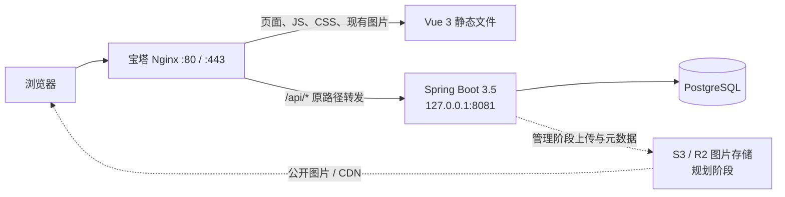

# LEKANG JOURNAL 系统架构

> 文档所有者：总控线程  
> 最近更新：2026-08-03  
> 状态：协作基线

## 1. 范围与参考

本文描述 LEKANG JOURNAL 的当前状态、目标拓扑和模块边界。V2 前后端范围、接口、目录和验收门槛见 [`v2-technical-design.md`](v2-technical-design.md)；后端领域模型、API、安全、数据一致性和部署细节以既有的 [`backend-technical-design.md`](backend-technical-design.md) 为基础。

该技术设计已确认的核心结论包括：Java 21 + Spring Boot 3.5 模块化单体、PostgreSQL + Flyway、Spring Boot 监听 `127.0.0.1:8081`、Nginx 同域代理 `/api`、公开读取先行、管理功能必须在 HTTPS 后开放，以及图片由站内静态资源逐步迁移到 S3 兼容对象存储。

该既有技术设计早于前端目录迁移，其中 `src/...` 等前端相对路径现在应理解为 `frontend/src/...`；文档正文保持原样，后续若需修订必须由总控与后端线程协调。

## 2. 当前系统架构

当前本地系统已包含 Vue 前端、Spring Boot 后端和 PostgreSQL 数据库：

- `frontend/src/` 保存页面、组件、路由、样式、内容数据和图片。
- `frontend/public/` 保存静态托管辅助文件。
- `frontend/package.json`、Vite 和 TypeScript 配置控制构建。
- 前端已存在统一 API 层、公开/管理 DTO、显式开发 Mock、Vite `/api` proxy、公共页面和 `/admin` 管理页面；V2-1～V2-3 已完成本地真实浏览器验收。
- `frontend/dist/` 是迁移后构建目录。
- 根目录 `dist/` 和 `node_modules/` 是迁移前生成物，当前保留，未删除或移动。
- 根目录 `.openai/hosting.json` 绑定一个 active 的 Sites 项目；本轮未保存新版本或部署。
- 线上站点为 `http://journal.lekang.site`。
- `backend/` 已实现 Java 21 / Spring Boot 3.5.4 模块化单体和 `/api/v1` 公开读取 API。
- 首页首屏眉题、三段主标题、说明文字及右侧轮播纸片文案由 `homepage_copy` 单记录配置维护；公开 `/api/v1/home` 返回 `heroCopy`，管理端通过受保护的 `/api/v1/admin/homepage/copy` 读写并在提交后清理首页缓存。
- 后端源码现包含 Flyway V1～V9；本机 PostgreSQL 18 的独立 `lekang_journal` schema 此前已执行 V1～V4 并导入初始内容，本次未操作或升级本机数据库。
- 本地 readiness、文章列表、详情、首页、搜索、归档、影集与资料接口均已返回 200；原 PostgreSQL 空参数查询错误已经修复。
- 公共页面已在 1280px、768px、375px 三档视口完成浏览器验收；管理端已完成登录、草稿、编辑、预览、发布、撤回、归档和退出的真实浏览器闭环。
- `deploy/` 尚无可执行部署资产，线上 Nginx、数据库、域名和 SSL 未修改。
- 截至 2026-07-29，`D:\lekang` 不是可识别的 Git 工作区，因此推荐分支和 Worktree 尚不能创建。

## 3. 目标系统架构



目标仍是单域部署：

```text
http(s)://journal.lekang.site/              -> Vue 静态站点与 Vue Router
http(s)://journal.lekang.site/api/v1/...    -> Nginx -> 127.0.0.1:8081
```

Spring Boot 通过最小权限账号访问 PostgreSQL。`8081` 和数据库端口只允许本机访问，不对公网开放。

## 4. Nginx 与 `/api` 反向代理

目标代理方式是保留原始 `/api/v1/...` 路径后转发到 Spring Boot：

```nginx
location /api/ {
    proxy_pass http://127.0.0.1:8081;
    proxy_http_version 1.1;
    proxy_set_header Host $host;
    proxy_set_header X-Real-IP $remote_addr;
    proxy_set_header X-Forwarded-For $remote_addr;
    proxy_set_header X-Forwarded-Proto $scheme;
}

location = /api {
    return 308 /api/;
}

location / {
    try_files $uri $uri/ /index.html;
}
```

`proxy_pass` 的目标末尾不加 `/`，避免意外剥离 `/api`。该片段仅是目标配置说明，不代表已修改线上 Nginx；实施前必须备份、检查完整 `server` 配置、执行 Nginx 语法检查并准备回滚。

## 5. 前后端职责边界

| 前端负责 | 后端负责 |
|---|---|
| 页面、路由、交互、展示状态和可访问性 | 内容规则、发布状态、权限、事务和数据一致性 |
| 通过统一 API 层调用 `/api/v1` | 提供稳定、版本化的 REST API |
| 加载、空状态和错误状态 | 参数校验、Problem Details、日志和审计 |
| 保持公开页面 URL 和文章 slug | 保证 slug 唯一、不可随标题变化 |
| 不在生产失败时静默回退到 Mock 数据 | 只返回符合发布条件的公开内容 |

数据库 Entity 不直接作为 API 契约；前后端通过 DTO/OpenAPI 和文档化字段语义协作。

## 6. V2 当前实施主线

V2 是同时包含前端、后端和上线准备的全栈版本，详细基线见 [`v2-technical-design.md`](v2-technical-design.md)。当前工作严格按以下顺序推进：

| 工作包 | 交付目标 | 主要责任 | 进入下一步的验收门槛 |
|---|---|---|---|
| V2-0 | 修复并冻结公开读取 API | 后端主责、前端验证 | 文章、home、search 等查询在 PostgreSQL 下通过，公开 API 冒烟和回归测试通过 |
| V2-1 | 完成公共前端真实数据 | 前端主责、后端提供契约 | 现有 API 层和公共页面在真实模式下验收，生产不静默回退 Mock |
| V2-2 | 建立管理安全基线 | 前后端协作 | `/admin` 登录、Session、CSRF、路由守卫和权限边界通过 |
| V2-3 | 完成文章编辑闭环 | 前后端协作 | 草稿、编辑、预览、发布、撤回、归档和乐观锁通过 |
| V2-4 | 文章优先公开站改版 | 前端主责 | 白色现代视觉下的首页、文章、搜索和归档在三档视口通过；URL 与 API 兼容 |
| V2-5 | V2 上线准备 | 部署主责、前后端配合 | HTTPS、备份、构建、Flyway、Nginx、回滚和冒烟验收通过 |

本地开发和生产都使用相对地址 `/api/v1`。本地优先通过 Vite dev proxy 将 `/api` 转发到 `127.0.0.1:8081`，减少开发环境与生产同域行为差异；若采用 CORS，必须只允许明确的本地来源。

`/admin` 已确认集成在当前 Vue 项目中，不另建独立管理前端。管理页面可以在本地开发和测试，但登录、编辑、上传等管理功能不得在仍为 HTTP 的生产站点开放。

## 7. 图片存储规划

1. 现阶段保留 `frontend/src/assets/` 中的现有图片；本次只随前端工程整体迁移，不单独重命名图片。
2. 公开读取阶段允许媒体记录引用现有站内静态 URL。
3. 管理与上传阶段引入 S3 兼容对象存储（候选为 Cloudflare R2）；数据库只保存对象 key、尺寸、MIME、alt 文本和处理状态，不存图片二进制。
4. 生成带内容哈希的多尺寸 WebP，原图限制后台访问；是否增加 AVIF 后续评估。
5. 对象存储、CDN 域名、生命周期、备份与费用方案尚待确认。

## 8. 登录与 HTTPS

- HTTP 阶段只允许部署无需认证的公开读取 API。
- 管理登录、编辑、发布和上传必须在 HTTPS 配置和验证完成后开放。
- 单管理员场景优先使用服务端 Session、`HttpOnly + Secure + SameSite=Strict` Cookie 和 CSRF 防护。
- 生产前后端同域，默认不启用宽泛 CORS；本地开发仅允许明确来源。
- HTTPS 上线后再评估 HSTS，并先确认所有子域影响。

## 9. 为什么不采用微服务

项目由少量协作者维护，核心领域共享同一套内容和事务边界，当前流量与部署规模不需要服务拆分。微服务会提前引入服务发现、分布式故障、跨服务事务、独立发布和额外监控成本。模块化单体能通过清晰包边界获得大部分组织收益，同时保持一次构建、一次部署和本地事务；未来只有在明确的容量或团队边界出现后才重新评估拆分。

第一阶段同样不引入 Redis、Kafka、Elasticsearch 或 Kubernetes。缓存、异步、搜索和编排先使用应用内能力、PostgreSQL 和简单可靠的单机部署。

## 10. 前端目录迁移结果与部署约束

2026-07-29 经用户确认，前端源码与构建配置已整体迁入 `frontend/`：

- 已迁移 `src/`、`public/`、`package*.json`、`index.html`、`vite.config.ts`、`tsconfig*.json` 和 `.npmrc`。
- 根目录 README 已改为从 `frontend/` 运行命令。
- `.openai/hosting.json` 保持在根目录，现有 Sites 项目和线上版本未修改。
- 根目录迁移前的 `dist/`、`node_modules/` 保留，避免未经授权删除现有文件。
- 项目暂不创建 Git，因此没有分支、Worktree 或提交。

本地迁移完成不代表托管配置已经切换。下一次部署前必须确认托管平台能否使用 `frontend/` 作为 source/build working directory，或明确由部署流程将 `frontend/dist/` 作为发布产物。确认前不得保存或部署新版本。

## 11. 已确认决策

- 网站定位为个人数字文化档案，内容分类为 Football、Cinema、Books、Notes、Album。
- Vue 3 / Vite / TypeScript / Vue Router 前端保持 SPA。
- 后端采用 Java 21、Spring Boot 3.5、Spring MVC、Spring Data JPA。
- 架构采用模块化单体，不使用微服务。
- 数据库采用 PostgreSQL，结构变更必须使用 Flyway。
- API 统一前缀为 `/api/v1`。
- Nginx 同域反向代理 `/api` 到 `127.0.0.1:8081`。
- 第一阶段不引入 Redis、Kafka、Elasticsearch 或 Kubernetes。
- 未经授权不修改线上服务器、Nginx、数据库、域名或 SSL。
- 前端工程使用 `frontend/` 作为本地源码和构建工作目录。
- 暂时不创建 Git 仓库、分支或 Worktree。
- 当前实施顺序为“修复文章查询 API → 前端接入真实数据 → 开发 `/admin` 编辑后台”。
- 管理后台集成到当前 Vue 应用的 `/admin` 路由，不建立独立管理前端。
- 公开首页提供私人留言入口，`POST /api/v1/messages` 只写入管理员收件箱，不公开展示；管理端在 `/admin/messages` 分页处理未读、已读与归档状态。公开提交使用蜜罐、字段长度校验和单实例内存限流，管理写操作继续要求 Session、管理员角色与 CSRF。
- V2 是包含公共前端、管理前端、后端和上线准备的产品版本，不等同于 Flyway V2 数据迁移。

## 12. 待确认决策

- 将来何时创建 Git 仓库并启用分支/Worktree。
- 静态托管是否支持将构建工作目录改为 `frontend/`，或是否发布 `frontend/dist/`；`.openai/hosting.json` 继续保留在根目录。
- HTTPS 启用时间和证书方案；启用前不开放管理功能。
- `/admin` 第一版管理员账号初始化方式、Session 有效期和密码轮换流程。
- 图片对象存储供应商、公开域名、CDN、生命周期和备份策略。
- PostgreSQL 具体版本、服务器资源预算以及 staging 环境是否单独建立。
