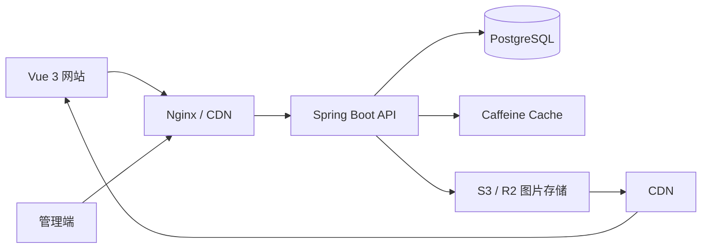
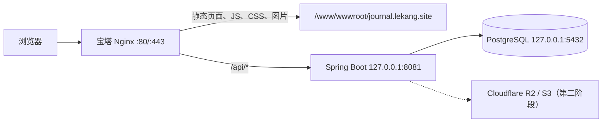
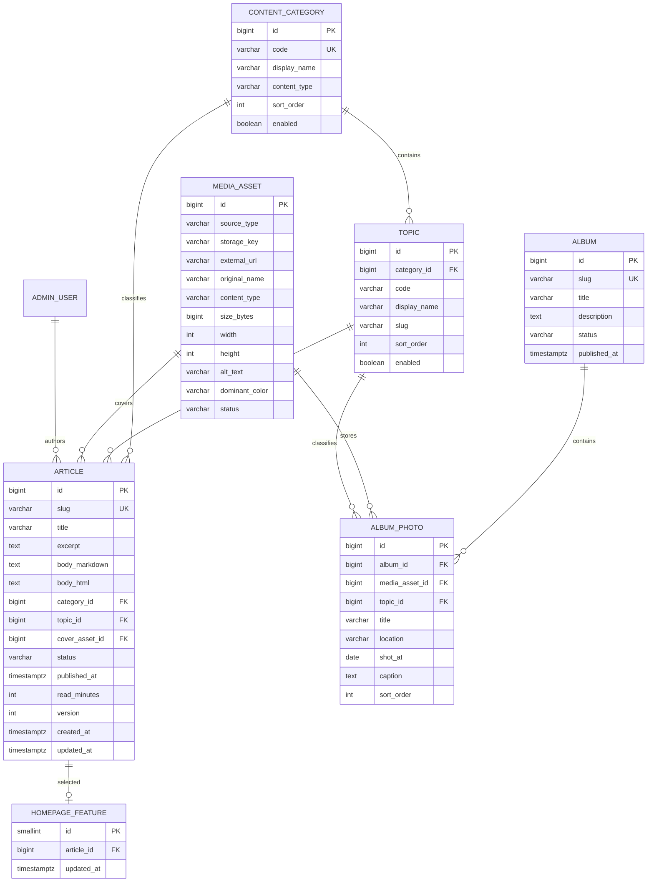

# LEKANG JOURNAL 后端技术设计与上线方案

> 文档状态：第三版，实施基线
>
> 更新时间：2026-07-28
>
> 当前前端：http://journal.lekang.site
>
> 目标：在不影响现有 Vue 静态站点的前提下，为 LEKANG JOURNAL 增加一个长期可维护、便于个人运营的 Java 后端。

## 0. 执行摘要

当前网站已经以 Vue 3 单页应用形式部署在宝塔 HTML 项目中，Nginx 根目录为：

```text
/www/wwwroot/journal.lekang.site
```

第一阶段不改动现有页面 URL，也不把网站改造成服务端模板项目。推荐新增一个独立的 Spring Boot 进程，监听服务器本机 `127.0.0.1:8081`，由现有 Nginx 将 `/api/` 请求转发给后端：

```text
http://journal.lekang.site/                  -> Vue 静态文件
http://journal.lekang.site/article/...       -> Vue Router
http://journal.lekang.site/api/v1/...        -> Spring Boot
```

前后端使用同一个域名，正式环境不需要开放后端端口，也不需要配置宽泛 CORS。现有 Java 项目已经占用 `8080`，LEKANG JOURNAL 后端固定使用已确认空闲的 `8081`。

推荐实施结论：

- 架构：Vue 静态前端 + Spring Boot 模块化单体 + PostgreSQL。
- 连接方式：Nginx 同域反向代理 `/api`。
- 第一阶段运行方式：宝塔 Java 项目运行 Spring Boot，固定监听 `127.0.0.1:8081`；Docker Compose 仅作为后续可选方案。
- 图片：第一阶段可以继续使用现有静态图片；内容管理阶段再接入 R2/S3。
- 搜索：先用 PostgreSQL，不引入 Elasticsearch。
- 后台登录：必须等 HTTPS 配置完成后再开放，HTTP 阶段只上线公开读取接口。
- 迁移方式：保留当前前端 Mock 数据，逐模块替换为真实 API，支持随时回退。
- 数据库变更：Flyway 只执行向前兼容迁移；应用回滚依赖数据库结构向后兼容，不假定数据库迁移可以自动回滚。

## 1. 项目背景

LEKANG JOURNAL 不是传统博客，而是一份个人数字文化档案。目前前端包含以下内容能力：

- 文章：Football、Cinema、Books、Notes 四个大类。
- Topic：每个大类下有二级主题，例如 `FOOTBALL / MESSI`。
- 首页：Feature、Now Watching、Latest Stories、文章分页。
- 文章阅读：详情、上一篇、下一篇。
- 发现：搜索、按年月归档、大类与 Topic 组合筛选。
- 个人影集：Album 及其 `CITY / DAILY LIFE / FOOTBALL / CINEMA` Topic。
- 个人资料：About、站点宣言、联系方式。

后端的核心任务不是堆功能，而是可靠地完成三件事：管理内容、组织内容、稳定地把内容交付给前端。

## 2. 设计原则

1. **单体优先**：采用模块化单体，不使用微服务。个人网站的数据量和团队规模不需要分布式复杂度。
2. **内容模型优先**：文章、Topic、影集和媒体资源是核心领域，接口围绕内容组织，而不是围绕数据库表机械暴露。
3. **公开读取与后台写入分离**：公开接口只读；新增、编辑、发布和上传均在受保护的管理接口中完成。
4. **可演进**：第一版只引入必要组件；访问量上升后再增加 Redis、搜索引擎或消息队列。
5. **稳定 URL**：文章使用不可变 slug 作为公开地址，修改标题不影响外部链接。
6. **数据库迁移可追踪**：所有结构变化通过 Flyway 管理，不手工修改生产库。

## 3. 推荐技术栈

| 层级 | 推荐方案 | 选择理由 |
|---|---|---|
| Java | Java 21 LTS | 成熟、长期支持，生态稳定 |
| Web 框架 | Spring Boot 3.5.x + Spring MVC | 适合 REST API；编码时固定到经过验证的最新安全补丁版本 |
| 安全 | Spring Security | 管理端登录、会话、CSRF、授权 |
| 数据访问 | Spring Data JPA + Hibernate | 内容类 CRUD 与分页开发效率高 |
| 数据库 | PostgreSQL 17+ | 事务、JSONB、索引和文本检索能力完善 |
| 数据迁移 | Flyway | 数据库版本可审计；配合向前兼容迁移支持应用回滚 |
| 参数校验 | Jakarta Validation | 请求 DTO 的统一校验 |
| API 文档 | springdoc-openapi | 自动生成 OpenAPI 与 Swagger UI |
| 映射 | MapStruct（可选） | Entity、Domain、DTO 显式转换 |
| 本地缓存 | Caffeine | 单实例阶段足够，不急于引入 Redis |
| 文件存储 | S3 兼容存储：Cloudflare R2 / MinIO | 图片不进入数据库，便于 CDN 分发 |
| 图片处理 | Thumbnailator 或 imgscalr | 生成 WebP/AVIF、多尺寸缩略图 |
| 监控 | Actuator + Micrometer | 健康检查、指标和基础可观测性 |
| 测试 | JUnit 5、MockMvc、Testcontainers | 使用真实 PostgreSQL 验证持久层 |
| 构建 | Maven | Java 项目依赖与发布管理清晰 |

第一版不建议直接引入 Redis、Kafka、Elasticsearch、Kubernetes。它们解决的是规模问题，不是当前的内容问题。

## 4. 总体架构



部署初期可运行在一台服务器上：Nginx 托管 Vue 构建文件并反向代理 `/api`，Spring Boot 连接 PostgreSQL，图片存储在 R2 或其他 S3 兼容对象存储中。

### 4.1 当前服务器上的具体拓扑



网络边界：

- 公网只开放 `80`，启用 HTTPS 后再开放 `443`。
- `8081` 和 `5432` 不对公网开放，只允许本机访问。
- PostgreSQL 创建独立数据库与最小权限账号，不使用超级管理员账号运行应用。
- Java 健康检查可以由 Nginx、宝塔或本机监控访问，不公开 Actuator 详细端点。

### 4.2 Nginx 集成配置

在现有 `server {}` 中，`/api/` 必须放在 Vue 的 `location /` 旁边：

```nginx
location /api/ {
    proxy_pass http://127.0.0.1:8081;
    proxy_http_version 1.1;

    proxy_set_header Host $host;
    proxy_set_header X-Real-IP $remote_addr;
    proxy_set_header X-Forwarded-For $remote_addr;
    proxy_set_header X-Forwarded-Proto $scheme;

    proxy_connect_timeout 5s;
    proxy_read_timeout 30s;
}

location = /api {
    return 308 /api/;
}

location / {
    try_files $uri $uri/ /index.html;
}
```

`proxy_pass` 后面不要增加路径结尾的 `/`，否则可能把 `/api` 前缀剥离。Nginx 应覆盖 `X-Forwarded-For`，不能直接信任客户端传入的同名请求头。

Spring Boot 配置：

```yaml
server:
  port: 8081
  address: 127.0.0.1
  forward-headers-strategy: framework
```

应用只能接受来自本机 Nginx 的连接。限流和审计代码使用经过 Spring 转发头处理后的 `request.getRemoteAddr()`，不自行读取原始 `X-Forwarded-For`。生产环境仅开放 readiness 健康信息，不通过公网暴露环境变量、Bean、配置或完整指标。

生产前端统一请求相对地址 `/api/v1`，不在代码中写死服务器 IP。

## 5. 后端工程结构

建议采用“按业务模块分包”的模块化单体，而不是把全项目所有 Controller、Service、Repository 分别堆在三个大目录中。

```text
com.lekang.journal
├── common
│   ├── config
│   ├── error
│   ├── security
│   ├── pagination
│   └── web
├── article
│   ├── api
│   ├── application
│   ├── domain
│   └── infrastructure
├── taxonomy
│   ├── api
│   ├── application
│   ├── domain
│   └── infrastructure
├── album
├── media
├── profile
├── homepage
├── search
└── admin
```

每个业务模块内部遵循：

- `api`：Controller、请求 DTO、响应 DTO。
- `application`：用例编排、事务边界、权限检查。
- `domain`：领域对象、枚举和业务规则。
- `infrastructure`：JPA Entity、Repository、对象存储等外部实现。

Controller 保持轻量，不直接访问 Repository；写操作在 Service/Application 层使用 `@Transactional`，查询操作使用 `@Transactional(readOnly = true)`。

上述分层是依赖方向，不要求每个小模块机械创建空目录或重复 Domain/Entity。简单 CRUD 可以保持简洁；跨模块依赖通过 application/api 边界完成，并可使用 ArchUnit 或 Spring Modulith 测试约束模块边界。

## 6. 核心数据模型

### 6.1 关系概览



所有业务时间统一使用 PostgreSQL `timestamptz`，数据库和应用内部以 UTC 保存，API 使用 ISO 8601 带时区格式输出。需要审计的表统一增加 `created_at`、`updated_at`、`created_by`、`updated_by`；软删除资源增加 `deleted_at`。公开使用过的文章 slug 永久保留，不因归档或软删除而复用。

### 6.2 文章

`article` 建议包含：

- `slug`：公开 URL，例如 `messi-world-cup`。
- `title`、`excerpt`：标题与摘要。
- `body_markdown`：作者编辑的原文。
- `body_html`：发布时生成并完成安全清洗的 HTML，用于快速读取。
- `category_id`、`topic_id`：文章必须属于一个大类和一个 Topic。为兼顾查询性能与数据库一致性，`topic(id, category_id)` 建立唯一约束，`article(topic_id, category_id)` 使用组合外键，不能只依赖 Java 层校验。
- `cover_asset_id`：关联媒体资源。
- `status`：`DRAFT`、`PUBLISHED`、`ARCHIVED`。
- `published_at`：发布时间，是归档、排序和上一篇/下一篇的依据。
- `read_minutes`：发布时根据正文长度计算，也允许人工修正。
- `version`：JPA 乐观锁字段，防止同时编辑覆盖。
- `created_at`、`updated_at`：创建和最后修改时间；发布、撤回、归档时间分别使用独立字段表达。
- SEO 字段：`seo_title`、`seo_description`，可后续加入。

正文第一版推荐 Markdown。它比任意富文本 JSON 更容易迁移和备份，也符合个人长期写作场景。发布时将 Markdown 转为 HTML，并使用白名单清洗器去除危险标签。

### 6.2.1 当前前端数据迁移映射

现有 `src/data/articles.ts` 中的字段可按以下方式迁移：

| 当前前端字段 | 后端字段 | 迁移说明 |
|---|---|---|
| `id` | `article.slug` | 保持不变，现有文章 URL 不变 |
| `category` | `content_category.code` | 导入 FOOTBALL、CINEMA、BOOKS、NOTES |
| `topic` | `topic.code` | 导入现有二级主题，并关联所属大类 |
| `title` | `article.title` | 原样迁移 |
| `excerpt` | `article.excerpt` | 原样迁移 |
| `date` | `article.published_at` | 将 `yyyy.MM.dd` 转为时间字段 |
| `readTime` | `article.read_minutes` | 提取数字，后续由后端自动计算 |
| `image` | `media_asset` | 初期可保存现有静态 URL，后续迁移到对象存储 |
| `sections` | `body_markdown/body_html` | 转换为 Markdown，保留标题、段落、引用和列表 |

首次迁移应通过一次性、幂等的数据导入程序完成，并输出导入数量、跳过数量和错误清单。Flyway 负责表结构与固定字典数据，不建议在版本迁移中长期承载会变化的业务文章。不能让前端和数据库长期各维护一份“真实数据”。

### 6.3 大类与 Topic

大类和 Topic 必须存在于数据库，不应继续写死在前端枚举中。建议初始化：

- Football：Messi、Tactics、Argentina。
- Cinema：War Film、TV Series、Film Notes。
- Books：Latin America、Borges、Solitude。
- Notes：Shanghai、Building、Fragments。
- Album：City、Daily Life、Football、Cinema。

Topic 表带有 `category_id`，后台创建或编辑文章时只能选择当前大类下的 Topic。

### 6.4 影集和媒体

原始图片与派生图片存储在对象存储中，数据库只保存元数据和对象 key。为兼容现有静态图片，`media_asset.source_type` 支持 `LOCAL_STATIC`、`S3`，其中前者保存站内相对 `external_url`，后者保存 `storage_key`；两者使用检查约束保证只有对应字段非空。迁入 R2 后可更新资源记录，不影响文章关系。

媒体处理采用明确状态：`UPLOADING -> UPLOADED -> PROCESSING -> READY`，失败进入 `FAILED` 并记录原因。complete 接口必须向对象存储核验对象存在、大小和 MIME，不能只相信客户端声明。一次上传建议生成：

- 原图：仅后台保留，不直接用于前台。
- Large：宽 1920px，用于 Hero 或影集大图。
- Medium：宽 1200px，用于文章卡片。
- Thumbnail：宽 480px，用于管理端预览。
- 优先 WebP；浏览器兼容策略成熟后增加 AVIF。

`album_photo` 独立保存标题、地点、拍摄日期、图注、Topic 和排序值。这样调整影集顺序不需要改图片本身。

缩略图生成必须幂等、可重试。关键图片处理不使用可能随进程重启丢失的裸 `@Async`；第一阶段使用数据库 `media_job` 任务表与定时扫描即可，不需要消息队列。

## 7. API 设计

API 统一前缀为 `/api/v1`。公开读取接口和管理接口分离。

留言功能是公开写入接口的受控例外：留言不在公开站展示，也不保存来源 IP。应用使用反向代理处理后的远端地址作为临时限流键，默认 30 分钟最多 3 条；单实例内存限流在重启后重置，多实例部署前需重新评估共享限流。管理员通过 `GET /api/v1/admin/messages`、`GET /api/v1/admin/messages/count`、`POST /api/v1/admin/messages/{id}/read` 和 `POST /api/v1/admin/messages/{id}/archive` 处理收件箱，写操作携带实体 `version` 并受 CSRF 保护。Flyway V9 新增 `guest_message` 表、状态/时间约束及按状态和创建时间查询的索引。

### 7.1 公开接口

| 方法 | 路径 | 用途 |
|---|---|---|
| GET | `/api/v1/home` | 一次返回可配置首屏文案、Feature、Latest Stories、个人资料摘要 |
| GET | `/api/v1/articles` | 文章分页及大类、Topic 筛选 |
| GET | `/api/v1/articles/{slug}` | 文章详情 |
| GET | `/api/v1/articles/{slug}/navigation` | 上一篇与下一篇 |
| GET | `/api/v1/taxonomies` | 所有大类及其 Topic |
| GET | `/api/v1/archives` | 按年份、月份聚合文章 |
| GET | `/api/v1/search` | 搜索标题、摘要、正文、大类和 Topic |
| GET | `/api/v1/albums` | 公开影集列表 |
| GET | `/api/v1/albums/{slug}` | 影集信息 |
| POST | `/api/v1/messages` | 提交私人留言到管理员收件箱；匿名可用，带字段校验、蜜罐与限流 |
| GET | `/api/v1/albums/{slug}/photos` | 影集照片，可按 Topic 筛选 |
| GET | `/api/v1/profile` | About、社交链接、站点宣言 |

文章分页示例：

```http
GET /api/v1/articles?page=0&size=6&category=FOOTBALL&topic=MESSI&sort=publishedAt,desc
```

分页响应保持稳定结构：

```json
{
  "items": [],
  "page": 0,
  "size": 6,
  "totalItems": 12,
  "totalPages": 2,
  "hasNext": true
}
```

`size` 由后端限制为 1 到 50，避免客户端一次请求过多数据。公开接口只返回 `PUBLISHED` 且 `published_at <= now()` 的内容。

`sort` 不直接映射任意 Entity 字段，只接受后端白名单值。所有列表与上一篇/下一篇使用稳定排序，例如 `published_at DESC, id DESC`，避免相同发布时间导致翻页重复或导航漂移。当前内容量使用 offset 分页足够；数据规模明显增长后再评估以 `published_at + id` 为游标的分页。

### 7.2 管理接口

| 方法 | 路径 | 用途 |
|---|---|---|
| POST | `/api/v1/admin/session` | 管理员登录 |
| DELETE | `/api/v1/admin/session` | 退出登录 |
| GET/POST | `/api/v1/admin/articles` | 草稿列表、创建文章 |
| GET/PUT | `/api/v1/admin/articles/{id}` | 获取和更新文章 |
| POST | `/api/v1/admin/articles/{id}/publish` | 发布文章 |
| POST | `/api/v1/admin/articles/{id}/unpublish` | 撤回文章 |
| PUT | `/api/v1/admin/homepage/feature` | 切换首页 Feature |
| GET/PUT | `/api/v1/admin/homepage/copy` | 读取或更新首页首屏眉题、三段标题、说明文字及右侧轮播纸片文案 |
| GET/POST/PUT | `/api/v1/admin/taxonomies/**` | 管理大类与 Topic |
| POST | `/api/v1/admin/media/uploads` | 获取预签名上传信息 |
| POST | `/api/v1/admin/media/{id}/complete` | 确认上传并触发图片处理 |
| GET/POST/PUT | `/api/v1/admin/albums/**` | 管理影集与照片 |
| GET/PUT | `/api/v1/admin/profile` | 管理个人资料与站点设置 |

发布、撤回等状态变化应使用明确动作接口，不通过一个模糊的通用更新接口改变所有状态。

管理端更新必须携带版本号或 `If-Match`，乐观锁冲突返回 `409 Conflict`，不能静默覆盖另一窗口的编辑结果。

## 8. 返回格式与异常处理

成功响应直接返回资源或分页对象，不额外包装无意义的 `code: 200`。错误响应使用 Spring Boot 3 的 RFC 7807 Problem Details：

```json
{
  "type": "https://journal.lekang.site/problems/validation-error",
  "title": "Validation failed",
  "status": 400,
  "detail": "topic does not belong to category FOOTBALL",
  "instance": "/api/v1/admin/articles",
  "requestId": "..."
}
```

使用统一 `@ControllerAdvice` 处理参数校验、资源不存在、状态冲突、未认证、无权限和未知异常。未知异常记录完整堆栈，但不能把数据库信息或堆栈返回给客户端。

生产配置启用 Spring Problem Details；字段校验错误可在扩展字段 `errors` 中返回稳定的字段名和错误码。每个响应透传或生成 `requestId`，便于前后端关联日志。

## 9. 搜索方案

第一阶段文章数量少，直接使用 PostgreSQL：

- Flyway 启用 `pg_trgm`，并为 `lower(article.title)`、`lower(article.excerpt)` 和 `lower(article.body_markdown)` 建立 GIN trigram 索引；扩展对象位于 `public` schema，使用 `currentSchema=lekang_journal` 时查询和操作类需显式限定 `public`。
- 中文搜索使用规范化关键词配合 trigram/模糊匹配，但不将其描述为完整中文分词或语义搜索。
- 查询只命中已发布且已到发布时间的文章，标题相似度权重高于摘要和正文，并叠加标题/摘要子串命中加分；发布时间和 ID 提供稳定的次级排序。
- 搜索关键词长度限制为 2 到 100 个字符。

当文章量或搜索要求显著提高，再接入 Meilisearch 或 Elasticsearch。当前阶段不建议为十几到几百篇内容维护独立搜索集群。

第一阶段搜索验收范围限定为：完整标题、标题片段、Topic 和摘要/正文片段可命中；不承诺同义词、中文分词和语义相关性。代表性查询需执行 `EXPLAIN (ANALYZE, BUFFERS)`；当前 12 篇文章的本机计划选择 Seq Scan 属于小表成本优化，数据量增长后应复查 GIN 索引命中情况，并设置数据库查询超时、限制通配符和超长查询造成的资源消耗。

## 10. 鉴权与安全

网站只有一个内容作者，管理端推荐使用服务端 Session，而不是让浏览器在 localStorage 保存 JWT：

- 登录成功后设置 `HttpOnly + Secure + SameSite=Strict` Cookie。
- 写接口启用 CSRF 防护。
- 管理接口统一要求 `ROLE_ADMIN`。
- 密码使用 Argon2id 或 BCrypt 保存，不保存明文。
- 登录接口限流并记录失败次数。
- 生产环境前后端同域，不启用 CORS；仅 `local` Profile 允许明确列出的本地开发地址。
- DTO 使用白名单字段，禁止直接将 JPA Entity 作为请求对象。
- 上传限制 MIME、扩展名、文件大小和图片尺寸；重新编码图片并移除 EXIF 中的敏感位置数据。
- 反向代理必须覆盖而不是追加转发头；应用不直接信任客户端提供的 `X-Forwarded-For`。
- 管理日志记录操作者、资源、动作、结果和 requestId，但不记录密码、Cookie 或正文隐私数据。
- 生产环境关闭 Swagger UI/OpenAPI，或仅允许管理员和内网访问。
- 正文 HTML 使用明确的白名单清洗器，并限制链接、图片 URL 协议；站点配置 Content-Security-Policy，降低存储型 XSS 风险。
- 登录限流使用带最大容量和自动过期的缓存实现；避免无界 `Map` 按攻击者 IP 持续增长。

公开 GET 接口可以设置合理的缓存响应头；管理接口和草稿内容必须使用 `Cache-Control: no-store`。

当前站点如果仍使用 HTTP，只允许部署无需身份认证的公开读取接口。管理员密码、Session Cookie、文章编辑和图片上传必须在 HTTPS 启用后上线；不能通过明文 HTTP 登录管理后台。

HTTPS 启用后增加 HSTS。Session Cookie 明确设置 `HttpOnly`、`Secure`、`SameSite=Strict`、`Path=/api/v1/admin` 和合理有效期；登录、退出和 CSRF 失败均纳入安全审计。

## 11. 缓存策略

第一版使用 Caffeine 本地缓存：

- `home`：1 到 5 分钟。
- `taxonomies`：10 分钟。
- `article:{slug}`：5 到 30 分钟。
- `profile`：10 分钟。

文章发布、撤回、编辑以及 Topic 变更后主动清理相关缓存。图片使用带内容哈希的文件名，通过 CDN 设置长期缓存。

缓存清理必须发生在数据库事务成功提交之后，可使用 `@TransactionalEventListener(phase = AFTER_COMMIT)`；不能在事务提交前删除缓存，否则事务回滚后可能重新缓存旧数据。公开文章详情支持 `ETag` 或 `Last-Modified`，让浏览器和 CDN 正确执行条件请求。

只有当后端扩展到多实例时，才将共享缓存迁移到 Redis。

## 12. 数据一致性与发布流程

文章发布流程应在一个事务中完成：

1. 校验标题、slug、正文、封面、大类和 Topic。
2. 校验 Topic 确实属于所选大类。
3. 将 Markdown 转换并清洗为 HTML。
4. 计算阅读时间。
5. 更新状态与发布时间。
6. 提交事务。
7. 事务提交后清理缓存，并通过提交后事件执行非关键任务。

同一时间只能存在一篇首页 Feature。使用单行 `homepage_feature` 配置表保存当前文章 ID，切换时锁定该行并在同一事务内更新；不要只依靠“先取消旧 Feature，再设置新 Feature”的应用逻辑。这样数据库结构天然只能表达一个当前 Feature，未来也便于增加生效时间。

删除策略建议：文章默认归档或软删除；媒体资源只有在确认未被文章和影集引用后才允许物理删除。

数据库事务只包含数据库操作，不在事务中同步调用 R2/S3。媒体处理使用任务表，并通过唯一业务键保证重复调度不会生成重复派生文件。

## 13. 性能与数据库索引

建议至少建立以下索引：

- `article(slug)` 唯一索引。
- `article(status, published_at desc)`。
- `article(category_id, topic_id, status, published_at desc)`。
- `topic(category_id, slug)` 唯一索引。
- `album(slug)` 唯一索引。
- `album_photo(album_id, topic_id, sort_order)`。
- `media_job(status, next_attempt_at)`，供失败重试和任务扫描。

列表接口只查询卡片需要的字段，不读取完整正文。解决 JPA N+1 问题时优先使用 DTO Projection 或明确的 fetch join，不默认把所有关联改成 EAGER。

除索引外，Flyway 必须创建并测试以下数据库约束：

- `article(topic_id, category_id)` 到 `topic(id, category_id)` 的组合外键。
- 状态、媒体来源类型和任务状态的检查约束。
- `published_at` 与文章状态的合理性约束。
- sort order、文件大小、图片宽高等非负约束。
- 所有外键明确 `ON DELETE RESTRICT`、`SET NULL` 或级联策略，不能依赖数据库默认行为。

## 14. 配置与运行环境

使用 Spring Profile 区分：

- `local`：本地 PostgreSQL/MinIO，允许本地前端跨域。
- `test`：Testcontainers 临时数据库。
- `staging`：与生产近似，用于迁移和接口验证。
- `prod`：正式数据库、对象存储和严格安全配置。

密钥通过环境变量或 Secret 管理，禁止提交到 Git。配置包括：数据库连接、对象存储凭证、Cookie 属性、本地开发 CORS 白名单和上传限制。

生产环境不配置 CORS 白名单；CORS 仅属于 `local` 配置。HikariCP 连接池大小、连接超时、事务超时和数据库语句超时必须显式设置，并根据单机资源与监控结果调整。

## 15. 部署方案

### 15.1 当前宝塔服务器推荐方案

第一阶段确定：前端继续作为宝塔“HTML 项目”，后端使用宝塔“Java 项目”运行 Spring Boot JAR，数据库使用服务器原生 PostgreSQL。该组合操作简单、资源占用低，作为当前实施基线。Docker Compose 保留为未来环境迁移方案，不与第一阶段混用。不要把后端 JAR 放进前端网站根目录。

建议目录：

```text
/www/wwwroot/journal.lekang.site/       # Vue 构建文件
/www/server/lekang-journal-api/         # JAR、配置和部署脚本
/www/backup/lekang-journal/             # 数据库备份
```

宝塔 Java 项目建议：

- 项目名：`lekang-journal-api`
- 端口：`8081`
- 启动环境：Java 21
- Spring Profile：`prod`
- 访问方式：只通过 `journal.lekang.site/api` 反向代理
- 自动启动：开启
- JVM 初始建议：`-Xms256m -Xmx512m`，后续根据内存监控调整

### 15.2 目标访问结构

```text
Internet
  └── Nginx / HTTPS
      ├── /          -> Vue dist
      ├── /api       -> Spring Boot 127.0.0.1:8081
      └── /media     -> CDN / R2

Spring Boot
  └── PostgreSQL
```

### 15.3 后端部署流程

1. 执行测试与 Maven 构建。
2. 生成带版本号的 JAR，例如 `lekang-journal-api-0.1.0.jar`。
3. 备份 PostgreSQL。
4. 上传新 JAR，不覆盖上一版本文件。
5. 启动新版本，Flyway 自动执行向前兼容迁移。
6. 检查 `http://127.0.0.1:8081/actuator/health/readiness`。
7. 经 Nginx 检查一个公开只读接口，例如 `/api/v1/taxonomies`。
8. 前端开始切换真实 API。
9. 执行首页、文章详情、筛选、分页和搜索冒烟测试。

PostgreSQL 至少每日备份，并定期做恢复演练；对象存储开启版本控制或生命周期保护。

Flyway 不承担生产数据库的自动降级。迁移遵循 expand/contract：

1. 先新增兼容字段、表或索引，旧 JAR 仍可运行。
2. 部署新应用并完成数据回填。
3. 观察稳定后，在后续独立版本中移除旧结构。

每次部署保留上一版本 JAR。应用回滚的前提是旧版本能够运行在迁移后的数据库结构上；破坏性 DDL 不与依赖它的应用版本在同一次发布中执行。

备份策略至少定义：每日全量备份、保留 14 天、备份文件加密、每季度恢复到新数据库验证。初期目标为 RPO 24 小时、RTO 4 小时，后续按内容更新频率调整。

### 15.4 环境变量

生产密钥只放在宝塔 Java 项目的环境变量或只读配置文件中：

```text
SPRING_PROFILES_ACTIVE=prod
DB_URL=jdbc:postgresql://127.0.0.1:5432/lekang_journal
DB_USERNAME=lekang_app
DB_PASSWORD=***
STORAGE_ENDPOINT=***
STORAGE_BUCKET=***
STORAGE_ACCESS_KEY=***
STORAGE_SECRET_KEY=***
```

生产环境不设置 CORS，因为前后端同域。只有本地开发的 `http://localhost:5173` 需要通过 `local` Profile 加入开发环境白名单。

## 16. 日志与可观测性

- 使用 SLF4J 输出结构化日志。
- 每个请求生成或透传 `requestId`。
- 记录 method、path、status、durationMs，不记录敏感数据。
- Actuator 仅公开 health；详细指标端点限制在内网。
- 监控 5xx 比例、P95 延迟、数据库连接池、磁盘/存储错误和登录失败次数。
- 使用 `admin_audit_log` 表持久记录登录、发布、撤回、删除和媒体操作的操作者、资源、结果、时间与 requestId；应用日志不能替代业务审计。

第一版不要求完整链路追踪平台，但代码应保留 Micrometer 接入能力。

## 17. 测试策略

### 单元测试

- Topic 与大类归属校验。
- 文章状态转换。
- 阅读时间计算。
- slug 生成与冲突处理。
- 影集排序和筛选。

### 集成测试

- 使用 Testcontainers 启动真实 PostgreSQL。
- 验证 Repository 查询、分页、归档和搜索。
- 验证 Flyway 能从空库完整迁移。
- 验证组合外键、检查约束、唯一约束和删除策略确实阻止非法数据。
- 验证媒体任务重复执行时保持幂等，并能从失败状态重试。
- 使用 MockMvc 测试公开接口和管理接口权限。

### 契约与端到端测试

- 根据 OpenAPI 约束前后端字段。
- 重点流程：发布文章、首页出现、筛选 Topic、搜索命中、上一篇/下一篇、上传影集照片。
- 每次部署执行公开首页和文章详情冒烟测试。

## 18. 前端迁移方式

迁移不需要一次性替换全部 Mock 数据，建议按以下顺序：

1. 接入 `/taxonomies`，替换前端写死的大类和 Topic。
2. 接入 `/articles`，替换首页文章列表、分页和筛选。
3. 接入 `/articles/{slug}` 与 navigation。
4. 接入 `/search` 和 `/archives`。
5. 接入 `/albums/{slug}/photos`。
6. 最后接入 `/home`、Now Watching 和 Profile。

迁移期间保留 Mock 数据作为开发 fallback，但生产构建不应静默回退到假数据；接口失败时展示明确错误状态。

建议在前端增加统一 API 层，而不是在 Vue 组件中直接散落 `fetch`：

```text
src/api/http.ts
src/api/articles.ts
src/api/taxonomies.ts
src/api/albums.ts
src/api/home.ts
```

生产 API 基础地址使用：

```text
/api/v1
```

文章详情路由继续使用现有 `/article/:id`。后端将当前 `id` 作为不可变 `slug`，因此上线后不需要改变已经发布的外部链接。

## 19. 分阶段实施计划

### Phase 0：服务器与数据库准备

- 安装 Java 21 和 PostgreSQL。
- 创建数据库、最小权限用户和每日备份任务。
- 确认 `8081`、`5432` 不对公网开放。
- 配置 Nginx `/api`；用本机 Actuator readiness 检查应用，用公开 taxonomy 接口验证反向代理。
- 为后续管理后台启用 HTTPS。

### Phase 1：内容读取 MVP

- 初始化 Spring Boot、PostgreSQL、Flyway。
- 完成大类、Topic、文章、影集、媒体数据模型。
- 实现公开文章、详情、筛选、分页、归档和影集接口。
- 导入当前前端 Mock 数据。
- 前端逐步替换本地数据。

### Phase 2：内容管理

- 管理员登录与 Session 安全。
- 文章草稿、编辑、预览、发布和撤回。
- 图片上传、处理和对象存储。
- 大类、Topic、影集、About、Now Watching 管理。

### Phase 3：上线质量

- 搜索索引、缓存、限流、日志与指标。
- 数据备份与恢复演练。
- OpenAPI 契约、Testcontainers 集成测试、部署流水线。
- SEO、RSS、站点地图和图片 CDN。

### 推荐实施顺序与验收点

| 顺序 | 交付物 | 验收标准 |
|---|---|---|
| 1 | Spring Boot 空项目与健康检查 | 本机 `/actuator/health/readiness` 返回 200，Actuator 详细端点不对公网开放 |
| 2 | PostgreSQL + Flyway | 空库能自动迁移，重复启动不报错，数据库约束测试通过 |
| 3 | 大类、Topic、文章读取 API | 当前 12 篇文章完整返回 |
| 4 | 前端文章列表与详情接入 | 页面 URL、排版和分页行为不变 |
| 5 | 搜索、归档、影集 API | 与当前前端功能一致 |
| 6 | HTTPS + 管理员 Session | Cookie 安全属性和 CSRF 验证通过 |
| 7 | 内容管理与图片上传 | 可完成草稿、预览、发布、撤回 |
| 8 | 备份、监控与恢复演练 | 能在 RTO 目标内从备份恢复到新数据库 |

## 20. 关键决策结论

- 架构：模块化单体，而非微服务。
- 语言：Java 21 LTS。
- 框架：Spring Boot 3.5.x + Spring MVC + Spring Security。
- 数据库：PostgreSQL。
- 内容格式：Markdown 原文 + 发布时生成的安全 HTML。
- 图片：初期兼容站内静态资源，内容管理阶段迁入 S3/R2，数据库只存引用和元数据。
- 鉴权：单管理员服务端 Session + CSRF。
- 搜索：先用 PostgreSQL，规模增长后再独立搜索服务。
- 缓存：先用 Caffeine，多实例后再使用 Redis。
- 部署：第一阶段宝塔 Java 项目 + 原生 PostgreSQL + Nginx + HTTPS；Docker Compose 作为未来迁移选项。
- 迁移：Flyway 向前迁移 + expand/contract，上一版本 JAR 仅在数据库向后兼容时回滚。

这套方案的目标是让 LEKANG JOURNAL 在当前规模下简单可靠，同时不会因为未来文章、Topic 和照片增加而推倒重来。

## 21. 实施边界与待确认项

本文件只完成架构与实施设计，本轮不创建 Spring Boot 工程、不安装数据库、不修改线上 Nginx，也不迁移当前前端数据。

已确定的实施基线：

1. PostgreSQL 使用服务器原生安装。
2. 后端使用宝塔 Java 项目并监听 `127.0.0.1:8081`。
3. 公开读取 API 可以先实施；管理员登录、编辑和上传必须在 HTTPS 启用后开放。
4. 生产环境前后端同域，不启用 CORS。

2026-07-29 已确认：管理后台集成到当前 Vue 项目的 `/admin` 路由，不建立独立管理前端。

V2 前端、后端、管理安全和上线门槛的统一实施基线见 [`v2-technical-design.md`](v2-technical-design.md)。本文继续作为后端领域与长期技术方案，不重复维护 V2 每个工作包的短期状态。

当前实施顺序固定为：

1. 修复文章查询 API，并在真实 PostgreSQL 下完成回归验证。
2. 前端通过统一 `frontend/src/api/` 和相对地址 `/api/v1` 接入真实数据。
3. 在当前 Vue 应用开发 `/admin`，后端实现 `/api/v1/admin/**`；生产开放登录、编辑、发布和上传前必须完成 HTTPS 与安全验收。
