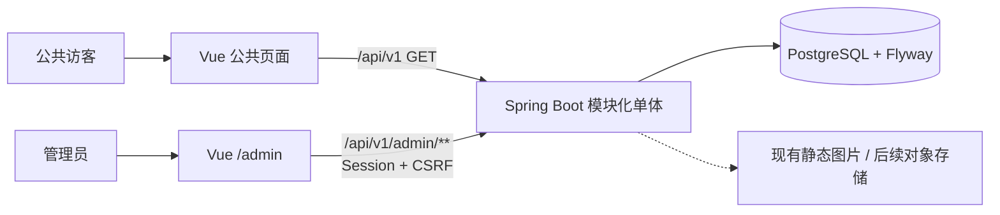

# LEKANG JOURNAL V2 全栈技术设计

> 文档所有者：总控线程  
> 协作所有者：前端线程、后端线程、部署线程  
> 最近更新：2026-08-11  
> 状态：V2-0～V2-4 已完成本地全链路验收；V2-5 上线准备待授权执行

## 1. 版本定义

本文中的 **V2** 是 LEKANG JOURNAL 的产品开发版本，不是 Flyway 的 `V2__seed_initial_content.sql`。现有 Flyway V1/V2 已进入本机数据库，历史迁移不得修改；V2 产品需要的新数据库结构从新的 Flyway 版本开始增加。

V1 当前基线：

- Vue 3 Editorial Magazine 公共站点和既有公开路由已存在；它们是待改版的 V1 实现，不再是 2.0 目标视觉基线。
- 公共前端已使用真实 `/api/v1` 数据完成桌面 1280px、平板 768px、手机 375px 浏览器验收，生产构建不包含 Mock 内容。
- Spring Boot 已实现并验证 `/api/v1` 公开读取、管理员 Session/CSRF 和文章管理接口。
- Flyway V1～V4、readiness、公开查询、PostgreSQL trigram 搜索和 12 篇初始内容已验证。
- Vue `/admin` 已实现登录、文章列表、Markdown 编辑/预览、发布、撤回、归档、未保存提示和乐观锁冲突处理。
- 2026-08-03 使用隔离 PostgreSQL 与临时管理员完成真实浏览器内容闭环；验收文章、管理员和审计记录已清理。

## 2. V2 目标

V2 将项目从“可浏览原型和读取 API”推进为“可以长期维护内容的全栈个人数字文化档案”：

1. 修复并冻结公开读取 API。
2. 让公共前端稳定使用 PostgreSQL 中的真实内容。
3. 将公开前端收敛为文章优先的现代白色个人内容站，并保持公开 URL 与文章 slug 兼容。
4. 在当前 Vue 应用中交付 `/admin` 管理后台。
5. 在 Spring Boot 中交付安全的单管理员 Session 和内容写入 API。
6. 完成草稿、编辑、预览、发布、撤回、归档的内容闭环。
7. 在生产开放管理功能前完成 HTTPS、备份、安全和回滚验收。

## 3. V2 核心范围与后续范围

### 3.1 核心 V2

- 公开文章首页、文章列表、文章详情、分类筛选、搜索和归档读取稳定。
- 公共前端真实数据接入和完整 loading、empty、error 状态。
- `/admin/login` 和受保护的 `/admin/**` 路由。
- 单管理员登录、退出、Session 状态和 CSRF。
- 文章管理：列表、新建、编辑、Markdown 预览、草稿保存、发布、撤回、归档。
- 文章封面媒体：受保护的 JPEG/PNG 上传、已有素材分页选择与公开图片读取。
- 乐观锁冲突处理和未保存内容离开提醒。
- 文章优先的 2.0 公开站视觉改版。
- 本地开发验证；生产管理功能以 HTTPS 为强制上线门槛。

### 3.2 V2 后续批次

- Category 与 Topic 的增删改和排序。
- 个人介绍、Profile 与 Now Watching 编辑。
- 个人资料类首页内容管理（文章精选管理已由用户在 2026-08-11 单独确认进入范围）。
- Album、Album Photo 管理。
- 电影、足球、阅读、生活记录等独立首页模块。
- S3/R2 对象存储、图片多尺寸处理和 CDN（本地安全上传已完成）。
- 管理审计查询界面。
- 修订历史、定时发布。

后续批次不得阻塞核心 V2 的文章编辑闭环。

### 3.3 不在 V2

- 用户注册、多作者、公开评论、点赞和会员系统。
- 微服务、Redis、Kafka、Elasticsearch、Kubernetes。
- 复杂富文本协作编辑或实时多人编辑。
- 在 PostgreSQL 中保存图片二进制。

## 4. V2 总体流程



开发和生产前端都使用相对地址 `/api/v1`。本地由 Vite 将 `/api` 代理到 `127.0.0.1:8081`；生产由 Nginx 执行同域代理。

## 5. 实施顺序与门禁

| 工作包 | 前端 | 后端 | 完成门禁 |
|---|---|---|---|
| V2-0 公开读取稳定 | 使用真实模式复现并验证错误状态 | 修复文章/search 查询并补 PostgreSQL 回归 | 公开 API 冒烟通过，文章列表不再返回 500 |
| V2-1 公共前端真实数据 | 完成所有公开页面接入和 Mock 退出策略 | 冻结 OpenAPI、日期、分页、图片 URL | 公共页面真实数据、状态和路由验收通过 |
| V2-2 管理安全基线 | `/admin/login`、Session 状态、路由守卫 | 管理员、Session、CSRF、权限、限流 | 登录/退出、401/403、CSRF 和 Cookie 验收通过 |
| V2-3 文章编辑闭环 | 列表、编辑器、预览、冲突和未保存提示 | 草稿 CRUD、发布/撤回/归档、乐观锁 | 新建至公开展示的完整流程通过 |
| V2-4 文章优先公开站改版 | 白色现代视觉、基础文章首页/列表/详情/搜索/归档 | 复用已冻结公开读取 API，不新增后端范围 | 三档视口、关键路由、状态与构建验收通过 |
| V2-5 上线准备 | 生产构建和浏览器冒烟 | verify、Flyway、readiness | HTTPS、备份、Nginx、回滚和安全验收通过 |

工作包必须顺序推进。允许提前设计后续契约，但不得在前一门禁失败时把后一阶段标为完成。

## 6. 公开前端与现有后端映射

| 前端位置 | 后端接口 | 当前前端基础 | V2 剩余工作 |
|---|---|---|---|
| `/works` | 无新增接口 | 独立作品页，展示可验证项目、背景、实现范围和后续计划 | 后续只在有真实项目材料时扩展 |
| `/capabilities` | 无新增接口 | 独立能力页，展示产品结构、前端互动、内容系统和实践方法 | 随真实项目证据更新，不虚构熟练度 |
| `/journal` | `GET /taxonomies`、`/articles` | 独立文章页，请求、分页、筛选与 AsyncState | 后端修复后真实数据回归；确认图片和空状态 |
| `/article/:id` | `GET /articles/{slug}`、`/{slug}/navigation` | 已有详情、导航、HTML 清洗 | 真实正文、404、无封面和直达刷新验收 |
| `/search` | `GET /search?q=...`、`GET /articles` | 已有防抖、取消请求、分页 | 修复共用查询；验证中文关键词和 Problem Details |
| `/archive` | `GET /archives`、分页读取 `/articles` | 已有归档聚合展示 | 评估全量抓取策略；内容增长后改为服务端按年月查询 |
| `/about` | 暂无接口 | 独立个人介绍、原则和工具卡片 | 真实履历字段冻结后再评估 Profile 接口 |
| Journal 的 Album 标签 | `GET /albums`、`/{slug}/photos` | 已有影集和照片请求 | 兼容保留，影集扩展延期，不进入 V2-4 核心首页 |
| `/` | `GET /home`、`/articles` | 作品、能力与文章概览首页 | 保持概览职责，不复制独立页面的全部内容 |

### 6.1 当前公开 DTO

前端 `frontend/src/types/api.ts` 已与现有后端响应对应：

- `PageResponse<T>`：`items`、`page`、`size`、`totalItems`、`totalPages`、`hasNext`。
- `ArticleSummary`：`slug`、`category`、`topic`、`title`、`excerpt`、`publishedAt`、`readMinutes`、`imageUrl`、`imageAlt`。
- `ArticleDetail`：ArticleSummary 字段，加 `bodyMarkdown`、`bodyHtml`、`updatedAt`。
- `ArticleNavigation`：可空 `previous`、`next`，每项包含 `slug`、`title`。
- `Taxonomy`：`code`、`displayName`、`contentType`、`topics`。
- `Profile`：`displayName`、`bio`、`manifesto`、可空 `email`、`nowWatchingTitle`、`nowWatchingDetail`。
- `HomepageCopy`：`eyebrow`、`headlinePrimary`、`headlineEmphasis`、`headlineAccent`、`description`，以及右侧轮播纸片的 `paperLabel`、`paperLineOne`、`paperLineTwo`、`paperLineThree`、`paperFooter`；作为 `Home.heroCopy` 返回，旧后端缺少整个对象或部分新增字段时前端逐字段使用既有默认文案。
- `Album`、`AlbumPhoto`、`ArchiveItem` 和 RFC 7807 `ProblemDetails`。

DTO 字段修改必须先更新 OpenAPI 和本文映射，再修改前端类型。前端不得依赖 JPA Entity。

### 6.2 Mock 规则

- `frontend/src/api/mock.ts` 只允许在开发模式且显式设置 `VITE_USE_MOCK_API=true` 时使用。
- 默认开发和所有生产构建都调用真实 `/api/v1`。
- 真实 API 失败时展示错误，不自动切换 Mock。
- Mock 保留到公开 API 和公共页面全部通过验收；之后是否删除由前端线程单独提出，不在 V2 文档同步阶段删除。

## 7. V2 前端设计

### 7.1 公开文章站产品与视觉基线

- 第一阶段导航突出作品、能力、文章、关于和搜索；归档继续由文章区与页脚访问，既有 URL 保持兼容。
- 作品、能力、文章、关于和搜索均使用独立路由；首页相同区块只承担摘要与引导，不用锚点导航冒充独立页面。当前新增 `/works`、`/capabilities`，`/journal` 已从 HomeView 拆为纯文章列表页。
- 首页定位为“求职作品集 + 个人文章”：首屏介绍、可验证作品、能力范围、重点文章、最新文章、分类入口和基础页脚。暂不加入近期状态、Now Watching、独立足球模块或影集陈列。
- 电影在前台信息架构中归入“日常”；足球不再作为首页模块或分类入口，但既有足球文章、slug 与直接访问继续保留，后端 taxonomy 语义暂不做破坏性迁移。
- GSAP 交互分为三类：首屏文字与主题纸片分层入场、指针轻视差和页面阅读进度；Article Deck 读取最近 4～5 篇真实文章并支持点击、拖动、触控滑动或键盘切换；About、Archive、Search 与 Article 的内容卡片通过按需加载的 ScrollTrigger 分段进入。所有场景均不自动轮播、不劫持滚动，也不使用粒子、发光或 3D 场景。
- 公共头部保持白色内容站调性，使用四色细条，并将品牌字标设计为完整连写的 “Lekang” 签名字体，以蓝、蓝紫、珊瑚红、暖黄和绿色跨整词渐变填充，不使用方块、外框或独立拆分字母；桌面导航通过 GSAP 实现完整 Logo 与整个导航组的首次轻量入场、路由活动胶囊平滑移动及滚动后的紧凑浮层状态，禁止为各导航链接设置可能中断后残留的独立入场位移。Logo 不从隐藏或零缩放状态开始，确保动画中断时仍完整可见。手机端继续使用可折叠菜单，减少动态效果模式下直接呈现静态导航。
- 公共页脚复用签名字标、四色短线、编号索引与小面积纸片卡，承担作品、能力、文章、归档和关于入口；保持白色主体和清晰留白，不使用大面积渐变或多彩统计卡。桌面使用三栏信息层级，平板收为两栏，手机为单列。
- 页面主背景使用 `#FFFFFF`，辅助背景 `#F7F8FA`，主文字 `#101828`，次要文字 `#667085`，边框 `#E4E7EC`；品牌蓝 `#3157D5` 仍为主强调，珊瑚红 `#F05A3C`、纸张黄 `#F4C542`、内容绿 `#25865A` 仅用于标签、纸片和小面积状态提示。禁止大面积渐变或用多彩统计卡制造 Dashboard 感。
- 标题和正文统一采用现代无衬线字体；文章正文目标宽度约 720px，公共内容最大宽度约 1200px。
- 作品区只陈列真实可验证项目，能力区只描述已有实现中使用的产品梳理、Vue/TypeScript/GSAP、Spring Boot/REST/PostgreSQL 等范围；在用户提供真实履历前不得虚构工作年限、项目数量、公司客户或业务结果。
- 卡片允许使用 12～16px 圆角、细边框和极弱阴影；不得使用大面积渐变、发光、毛玻璃、后台侧栏或虚构数据指标。
- 首页重点文章不自动轮播；动画仅限必要的透明度、轻微位移、纸片视差和阅读进度，并尊重 `prefers-reduced-motion`。
- Article Deck 是渐进增强：底层必须保留可访问的文章链接和静态列表布局；减少动态效果模式、GSAP 加载失败或低性能场景下直接使用静态卡片。GSAP 应在组件需要时懒加载，实现阶段记录依赖与构建体积变化。
- ScrollTrigger 卡片动画同样属于渐进增强：关闭动态效果或插件加载失败时卡片必须直接可见；不同页面共享 `useScrollCardReveal`，不得在各页面复制初始化与销毁逻辑。
- 既有 `/journal`、`/article/:id`、`/search`、`/archive`、`/about` 及已发布 slug 保持兼容；若调整 `/` 与 `/journal` 的内容分工，不得破坏直达和刷新。

### 7.2 目录

```text
frontend/src/
├── components/
│   └── ArticleDeck.vue        # V2-4 GSAP 文章交互；可降级为静态文章列表
├── api/
│   ├── client.ts             # 公共请求、Problem Details
│   ├── journal.ts            # 公开读取接口
│   ├── admin.ts              # V2 新增：Session 与管理接口
│   └── mock.ts               # 仅显式开发模式
├── types/
│   ├── api.ts                # 公开 DTO
│   └── admin.ts              # V2 新增：管理 DTO
├── composables/
│   ├── useAdminSession.ts
│   └── useUnsavedChanges.ts
├── views/admin/
│   ├── AdminLoginView.vue
│   ├── AdminHomeView.vue
│   ├── AdminHomepageView.vue
│   ├── AdminArticleListView.vue
│   └── AdminArticleEditorView.vue
└── components/admin/
    ├── AdminShell.vue
    ├── MarkdownEditor.vue
    ├── ArticleForm.vue
    └── PublishActions.vue
```

目录是实施目标，不要求一次创建空文件。

### 7.3 `/admin` 路由

```text
/admin/login
/admin
/admin/articles
/admin/homepage
/admin/articles/new
/admin/articles/:id/edit
```

- `/admin/login` 对未登录用户开放。
- 其他管理路由设置 `meta.requiresAdmin`，路由守卫先检查 Session 状态。
- 401 清理内存中的 Session 状态并跳转登录；403 展示无权限；409 展示并发编辑冲突。
- 编辑页离开、刷新或切换文章时，如果有未保存修改必须提示。
- `/admin/homepage` 编辑首页首屏文案，写请求携带 `version`，冲突返回 409；公开首页继续保留缺省文案降级。
- `/article/:slug` 等公开 URL 保持不变。

### 7.4 管理请求

- 管理请求使用同域 `/api/v1/admin`。
- 使用服务端 Session Cookie，不在 localStorage/sessionStorage 保存 JWT、密码或 Session。
- 管理写请求携带 CSRF token；token 只保存在内存或按最终 Spring Security 契约读取。
- 登录、退出、草稿和管理响应使用 `Cache-Control: no-store`。
- API client 统一处理 RFC 7807、401、403、404、409 和 5xx。

### 7.5 文章编辑器

核心字段：

- slug、title、excerpt。
- categoryCode、topicCode。
- bodyMarkdown；`bodyHtml` 由后端生成和清洗，前端只用于预览。
- coverAssetId 或现有图片引用，具体契约在图片 URL 冻结时确定。
- status、publishedAt、readMinutes。
- version，用于乐观锁。

V2 核心编辑器使用 Markdown 文本编辑与预览，不引入复杂富文本框架。发布、撤回和归档使用独立动作，不通过普通更新请求偷偷改变状态。

## 8. V2 后端设计

### 8.1 V2-0 查询修复

- 修复 Article Repository 对可空查询参数的 PostgreSQL 类型推断。
- 测试无过滤、Category、Topic、关键词、分页和升降序。
- 测试 detail、navigation、home、search 和 archive 的相关查询。
- 公开接口只返回 `PUBLISHED` 且 `published_at <= now()`。
- 使用真实 PostgreSQL 验证，不能只依赖 MockMvc。

### 8.2 管理安全

计划接口：

| 方法 | 路径 | 用途 |
|---|---|---|
| POST | `/api/v1/admin/session` | 登录并返回管理员 Session 摘要与 CSRF 信息 |
| GET | `/api/v1/admin/session` | 查询当前 Session |
| DELETE | `/api/v1/admin/session` | 退出 |

- 单管理员密码使用 BCrypt 或 Argon2id。
- 管理员密码哈希不得写入 Git 或 Flyway 固定种子。
- Session Cookie 在生产设置 `HttpOnly`、`Secure`、合适的 `SameSite`、Path 和有效期。
- 写请求启用 CSRF；登录限流有容量和过期边界。
- 管理路径要求 `ROLE_ADMIN`，公开 GET 规则不得意外放开管理接口。

### 8.3 文章管理 API

计划接口：

| 方法 | 路径 | 用途 |
|---|---|---|
| GET | `/api/v1/admin/articles` | 分页读取草稿、已发布和归档文章 |
| POST | `/api/v1/admin/articles` | 创建草稿 |
| GET | `/api/v1/admin/articles/{id}` | 获取编辑详情 |
| PUT | `/api/v1/admin/articles/{id}` | 保存普通字段和 Markdown |
| POST | `/api/v1/admin/articles/{id}/publish` | 发布 |
| POST | `/api/v1/admin/articles/{id}/unpublish` | 撤回为草稿 |
| POST | `/api/v1/admin/articles/{id}/archive` | 归档 |
| GET | `/api/v1/admin/overview` | 返回三种文章状态计数与每日文案 |
| GET | `/api/v1/admin/media` | 分页读取可用媒体素材，最大 `size=50` |
| POST | `/api/v1/admin/media` | 以 `multipart/form-data` 上传 JPEG/PNG 封面，要求 Session 与 CSRF |
| GET | `/api/v1/media/{id}/content` | 公开读取已就绪的本地上传图片 |

管理 DTO 与公开 DTO 分离。更新请求必须携带 `version`；乐观锁冲突返回 `409 Conflict`。发布事务负责校验 taxonomy、生成并清洗 HTML、计算阅读时间、设置发布时间并在提交后清理缓存。

管理文章列表允许 `q` 搜索标题/slug；排序字段仅允许 `updatedAt`、`createdAt`、`title`，方向仅允许 `asc`/`desc`，并始终使用 ID 作为稳定次级排序。前端只对已保存且仍为草稿的文章启用 3 秒防抖自动保存；已发布或归档文章必须显式保存。当前没有修订历史，`version` 只提供并发冲突保护，不等同于可恢复快照。

媒体上传首版使用可替换的本地存储边界：文件写入 `journal.media.storage-root`，数据库仅保存存储键、公开 URL、MIME、尺寸、大小和替代文本。服务端限制 8MB、单边 8000px、总计 4000 万像素，仅接受内容与扩展名一致的 JPEG/PNG，并在公开前重新编码以清理 EXIF。存储键由服务端生成并经过目录边界检查；上传操作写入管理审计。生产切换 S3/R2 时保持 DTO 与文章 `coverAssetId` 语义兼容。

### 8.4 Profile 延期与首页精选管理

Profile 接口不属于当前 V2-4 文章优先改版，待用户重新确认个人主页扩展范围后再实施。首页文章精选已于 2026-08-11 获得明确授权，并以兼容方式扩展现有单篇 Feature：

| 方法 | 路径 | 用途 |
|---|---|---|
| GET/PUT | `/api/v1/admin/profile` | 编辑个人资料与 Now Watching |
| GET/PUT | `/api/v1/admin/homepage/features` | 读取并整体替换最多 5 篇有序首页精选 |

首页精选只能指向已到公开时间的已发布文章，ID 不得重复。整体替换在单一事务中完成并在提交后清除首页缓存；公共 `GET /api/v1/home` 新增有序 `features`，同时保留首篇 `feature` 以兼容既有客户端。

### 8.5 数据库迁移

- 不修改已执行的 `V1__create_content_schema.sql` 和 `V2__seed_initial_content.sql`。
- 新迁移从下一个未使用版本开始。
- 核心 V2 预计需要管理员账号、审计记录或安全相关字段；创建前先确认现有 schema，避免重复字段。
- 管理员初始密码通过一次性安全引导或环境变量生成哈希，不写入迁移。
- 所有迁移先在空 PostgreSQL 和代表性已有数据环境验证。

## 9. 错误、并发与缓存

- 错误响应统一使用 RFC 7807 Problem Details 和 requestId。
- 验证错误为 400，未登录 401，无权限 403，不存在 404，并发冲突 409。
- 前端不得把 5xx 解释为空数据。
- 更新文章时使用 `version`；冲突时保留用户未保存文本，并提供重新加载或复制内容。
- 文章保存、发布、撤回、归档后，在事务提交后清理 article、home、search 等相关缓存。

## 10. 验证矩阵

### 10.1 前端

- `npm run build`，包含 TypeScript 检查。
- 真实 API 模式下验证 `/journal`、文章详情、搜索、归档、About 和 Album。
- 验证直达和刷新、分页、筛选、取消旧请求、loading、empty、error、404 和 500。
- `/admin` 验证登录、退出、路由守卫、未保存提示、草稿保存、预览和发布。
- 生产构建验证不会启用 Mock。

### 10.2 后端

- Maven `test` 与 `verify`。
- PostgreSQL/Testcontainers 验证 Flyway、Repository 查询、约束和管理写入。
- 验证公开 API 不返回草稿、未来发布时间或归档内容。
- 验证 Session、CSRF、401/403、登录限流和 Cookie 配置。
- 验证发布状态机、HTML 清洗、乐观锁和缓存失效。

### 10.3 全链路

1. 管理员登录。
2. 创建草稿并预览。
3. 保存后刷新编辑页，内容保持一致。
4. 发布文章。
5. 公共首页/列表出现文章，详情 URL 使用稳定 slug。
6. 编辑已发布文章并验证版本冲突。
7. 撤回后公共接口不再返回。
8. readiness、公开 API 和关键页面仍正常。

## 11. V2 上线门槛

- 文章查询错误已修复，公开 API 回归通过。
- 前端真实数据和生产无 Mock 通过。
- 管理登录、Session、CSRF、权限、乐观锁通过。
- HTTPS 已启用并验证，Secure Cookie 生效。
- PostgreSQL 已备份，Flyway 对旧应用的兼容性和回滚路径明确。
- Nginx `/api`、Vue Router fallback、readiness 和关键页面冒烟通过。
- 没有密码、Token、Cookie、生产密钥或截图进入项目文件。

未满足以上条件时，可以在本地继续开发 V2，但不得开放生产 `/admin`。

## 12. 待确认决策

- 管理员初始账号和密码哈希的安全引导方式。
- Session 有效期、闲置超时和是否允许“保持登录”。
- 现有图片的正式公开 URL，以及对象存储接入时间。
- 是否为前端增加 Vitest；当前工程没有测试脚本。
- HTTPS 证书方案和生产开放时间。
# 留言与管理收件箱（2026-08-12）

- 首页加入私人留言表单，字段为昵称、可选联系方式和 10～2000 字正文；留言只进入管理员收件箱，不在公开站展示。
- 管理端新增 `/admin/messages`，提供全部/未读/已读/归档筛选、分页、未读徽标、打开即已读和归档操作。
- GSAP 仅增强投递信封、收件卡错落入场和阅读纸片展开；动态导入失败或用户启用 `prefers-reduced-motion` 时保持完整功能。
- API 使用 `/api/v1/messages` 与 `/api/v1/admin/messages/**`；公开提交免 CSRF，管理写操作保留 Session、角色和 CSRF 边界。
